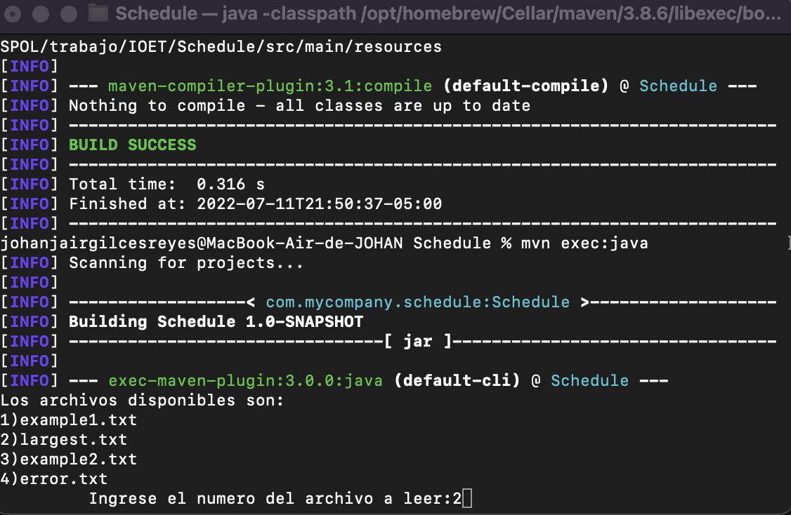

# ACME SCHEDULE EXERCISE
## Objective
The goal of this exercise is to output a table containing pairs of employees and how often they have coincided in the office.

## Solution:
The proposed solution utilizes an Object-Oriented approach, which uses primarily the `Employee` class, which contains most of the logic surrounding the problem. 

In order to solve the problem, the first step is to determine under which circumstances
two different employees coincide at the office. To do this, various methods were explored, however it was found that checking if the check-in hour of any 
employee is inside the range of the hours worked by the other employee (e.g. 10:00-12:00, the range would be 10,11,12) was the most effective way, due to the fact 
that it minimizes the number of comparisons needed to determine if they coincided or not. Furthermore, in order to reduce the time complexity of the solution, 
only the days in which both employees attended to the office are considered, this is obtained using Sets intersections. 


## Requisitos

* Instale Java, desde el [sitio oficial](https://www.java.com/es/download/)
* Instale Maven, desde el [mac](https://javabydeveloper.com/how-to-install-maven-on-mac-osx/). [windows](https://maven.apache.org/guides/getting-started/windows-prerequisites.html)
	- Mediante la línea de comandos, verifique la versión de Maven, con: `mvn -v`


## Instrucciones

* Desde la línea de comandos
	+ Ingrese a la carpeta con el ejercicio `cd ~/schedule`
	+ Compile el proyecto, with: `mvn compile`
    + Ejecute el proyecto, with: `mvn exec:java`
* Para cargar un nuevo archivo :
	+  Agregue su archivo .txt en la ruta
	```
  	src/data/
  	```
* Para ejecutar un archivo:
	+ Seleccione un archivo existente: 
  	```
  	
  	``` 


## Pruebas unitarias

* Desde la línea de comandos ejecute: `npm test`
* Los resultados posibles a las pruebas unitarias pueden ser: 
	+ Todos fueron exitosas, o
	+ Existen pruebas unitarias fallidas.
* En caso de ser necesario, modifique el/los archivo(s) y vuelva a ejecutar las pruebas unitarias. 
